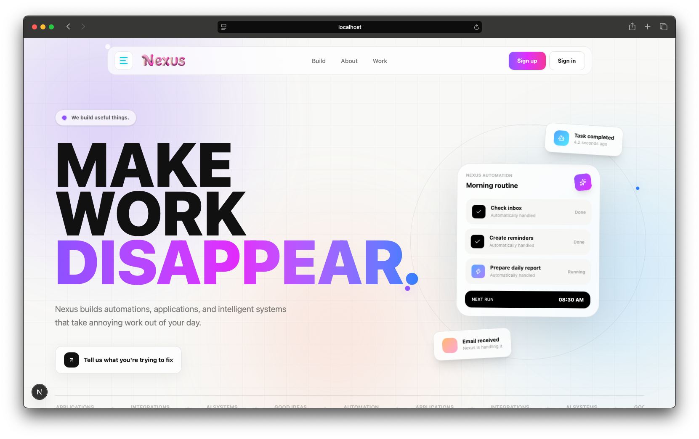
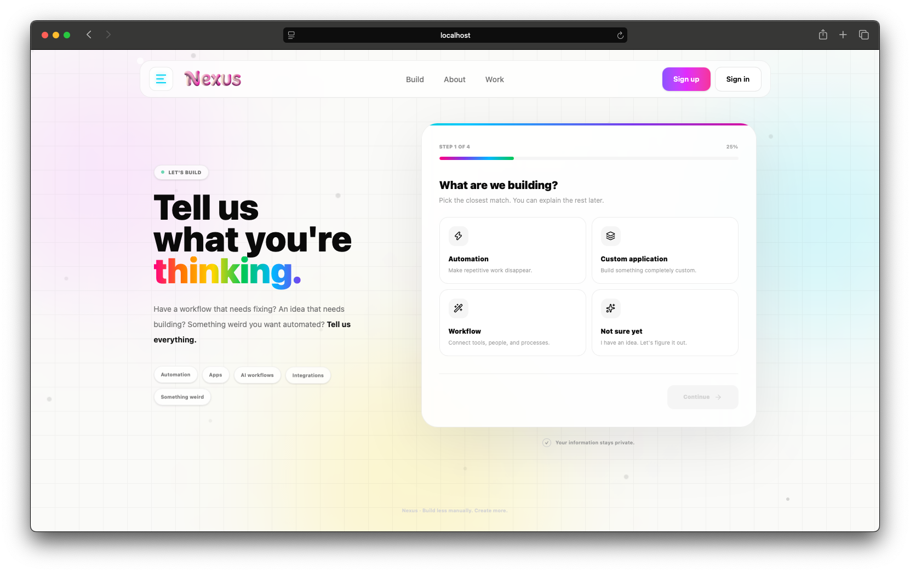
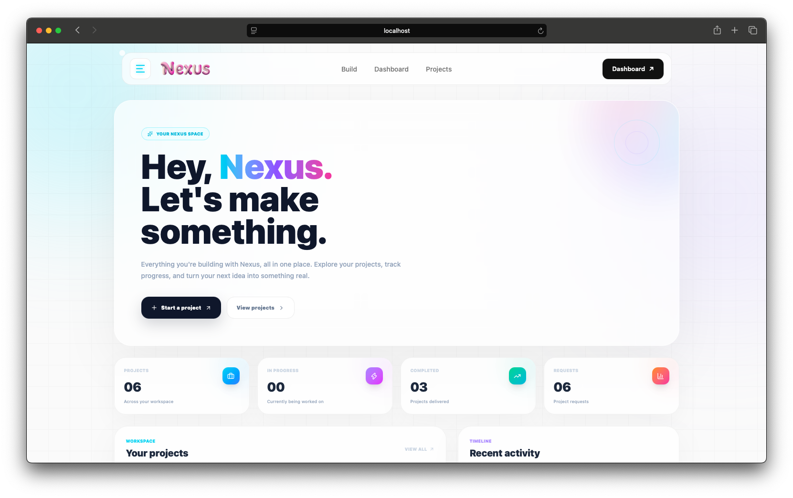
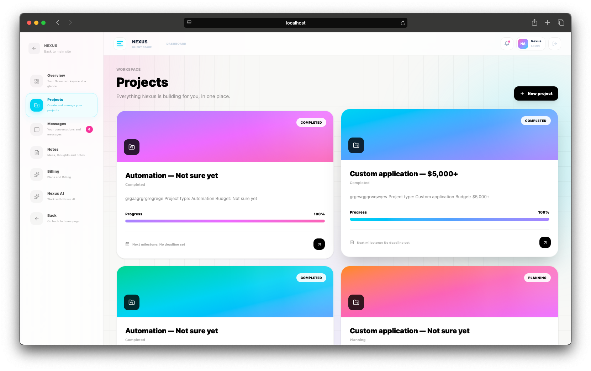
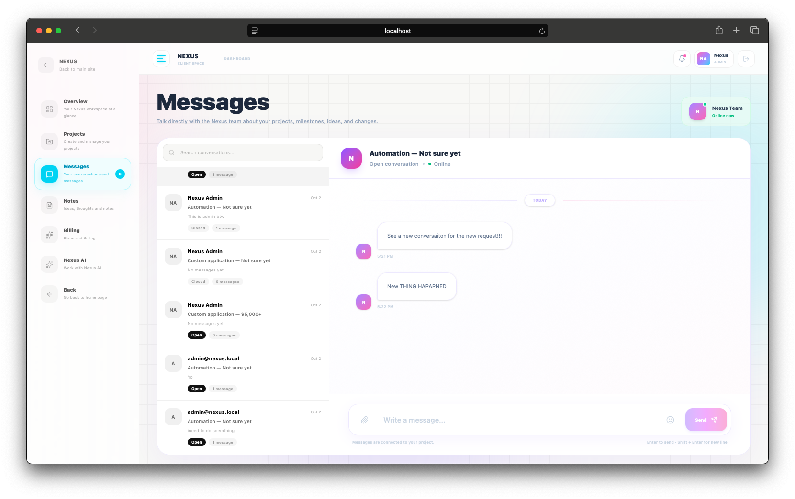
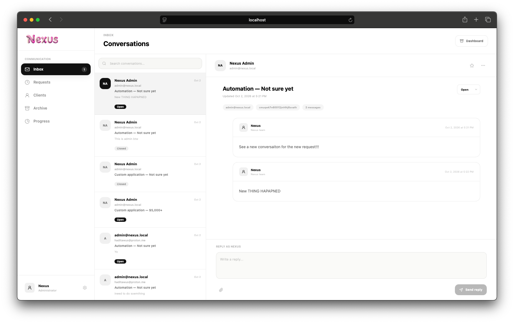
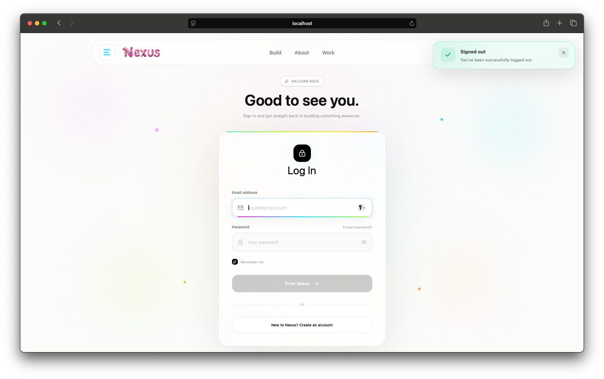

# Nexus

> A modern full-stack platform for building, managing, and connecting projects.

Nexus is a full-stack web application built around project management,
communication, requests, and a polished user experience.

> 🚧 Nexus is currently under active development.
> The features shown below represent the current implementation,
> with further polish, features, and improvements still in progress.

## ✨ Current Features

- Authentication and user accounts
- User dashboard
- Project management
- Project requests
- Messaging and conversations
- Admin inbox
- Request management
- Project progress tracking
- Dashboard statistics
- Global success/error/warning/info alerts
- Responsive navigation
- Light glassmorphism UI
- Framer Motion interactions
- Fastify + TypeScript backend
- Next.js frontend
- PostgreSQL database

## 🖥️ Screenshots

### Landing Page



### Build



### Dashboard



### Projects



### Messages



### Admin Inbox



### Global Alerts



## 🏗️ Tech Stack

### Frontend

- Next.js
- React
- TypeScript
- Tailwind CSS
- Framer Motion
- Lucide React

### Backend

- Fastify
- TypeScript
- Prisma
- PostgreSQL

## 📁 Project Structure

```text
nexus/
├── app/
│   ├── (default)/
│   ├── (user)/
│   └── (admin)/
├── components/
├── lib/
│   └── alert/
├── ./
└── ...
```
